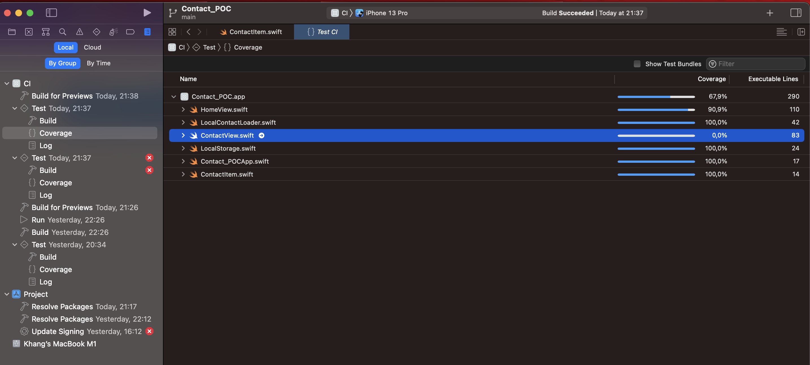
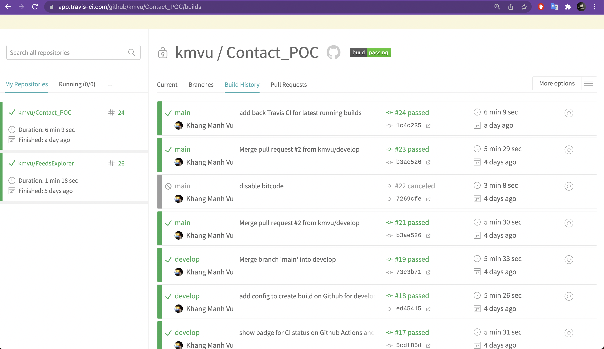
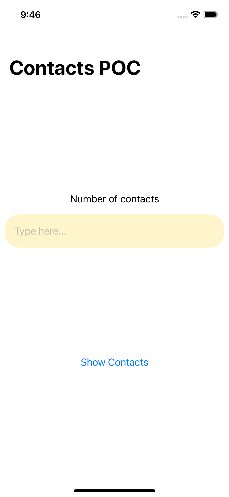
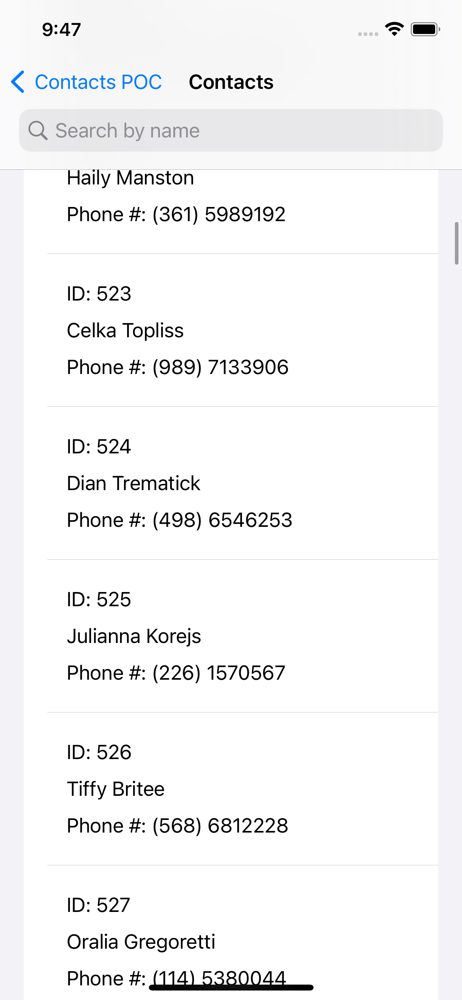
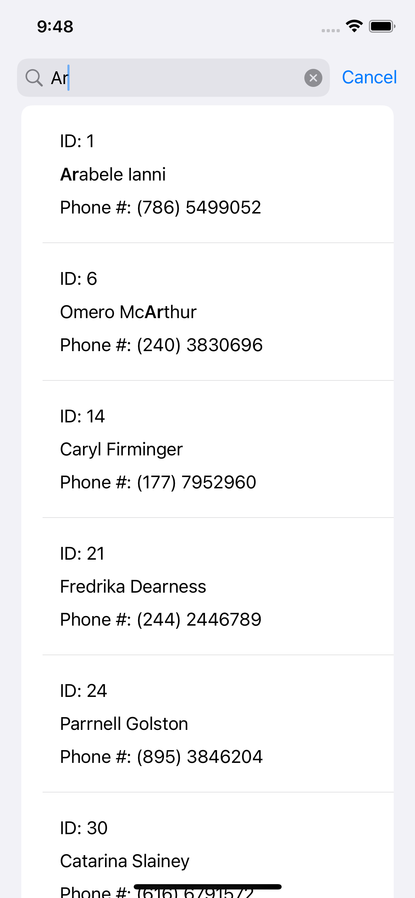
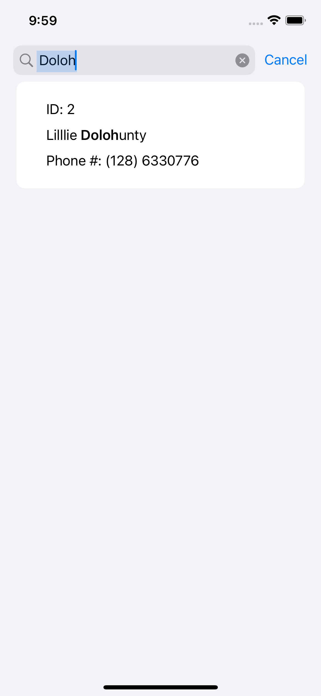
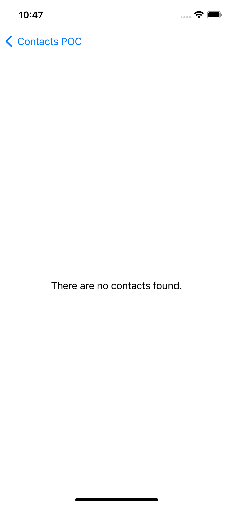
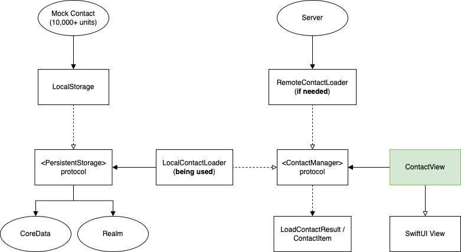

# Contact_POC

This is a demo app to showcase the Contacts Search capability using Swift UI.

# Overview

## Unit Tests

This app has been covered with almost 70% Unit tests, where all the logics are fully Unit tested, except the View (SwiftUI View).

Please look at the **Contact_POC_Tests** and **Contact_POC_EndToEndTests** files for more info.

These two files are included in the **CI** scheme in order to be run under *Travis CI* and *Github Actions* (their CI service) for Continuous Integration (CI) capability. You can go into the *Actions* tab on this Github repo for more info.

The CI pipelines will be triggered whenever new commits are pushed into the **main** and **develop** branch. Pull Request to **main* branch can also trigger these pipelines.

## The App UI

[Home Screen]

[Contact Screen]

[Searched and Highlight text "Ar"]

[Searched and highlight text "Doloh"]

[Empty Screen - with 0 contacts]

# Architecture

Starting from `Contact_POCApp.swift`, the app will be loaded along with the `LocalContactLoader`, which includes the `PersistentStorage` to store the data to local device.

The `HomeScreen` will then allow users to type in the number of contacts to request for the desired number to display.

The `ContactScreen` will display the list of items based the values typed from users after tapping on "Show contacts" button on the previous screen.

From here, users can search for the contact item which has the matching name from the search bar and scroll through if desired.

## Platform Compatibility

This repo has been setup to be run successfully on iOS 14.0+. Also can be used on XCode 12.0+ as well. But ideally, it should be run on iOS 15.0 and XCode 13.0+ in order to deliver the best performance as well as my initial intention.

## Persistence Storage

The `ContactManager` protocol is just an interface to return the contacts list back to SwiftUI. Hence, it is possible to have another use case, just in case we want to load the contacts from the server instead. By then, we can use the `RemoteContactLoader`.

The `PersistentStorage` could retrieve from either **CoreData** or **Realm Mobile Database**. However, to keep it simple, I generated the list of 10000 contacts on https://www.mockaroo.com/, in order to have better dataset when displaying. Hence, users can type up to 10000 only in the HomeScreen (since the requirements only said so for demo purposes). Any number that is less than 10000 will be trimmed from the item 0 up to that n desired number. (Run the demo app for more info).

The dataset downloaded will be in JSON format, and stored locally. It will then be loaded for use through the app just like retrieving from a Persistence storage for simplicity.

# Disclaimer

However, due to time constraints, the app was built without the following known features:

1. App was able to load 10000 contacts. However, with that many items, if we use the built-in Search in SwiftUI, along with the current logic, it will filter the result very slow if we attempt to use the app. I do have another solution though, which we can read directly from the dataset (JSON file in this case).

2. App cannot highlight all the items, even though the items were matched correctly. Due to limitation in SwiftUI, the current implementation cannot fully highlight all the partial characters in all matched result. We will need to have another approach for this, probably using UIKit and port it over. But will take some more times.

3. The Unit test for SwiftUI View can be fully covered to make it 100% coverage. However, will need more time to integrate and implement this. For this assignment, I only focused on the business logic as well as the Domain (Contacts features) layer, where it should be fully tested and reusable when needed. Since this is more important, I will leave it as is.
